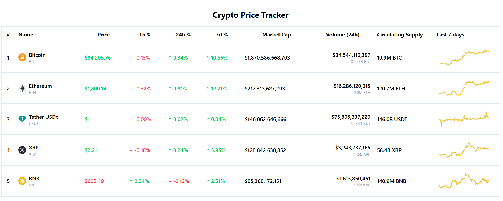
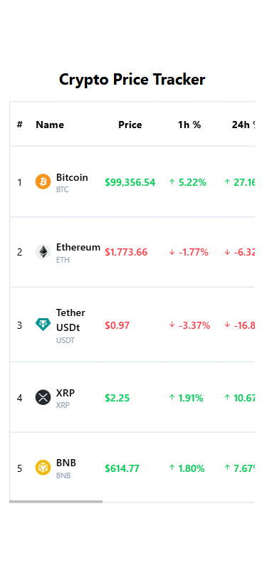
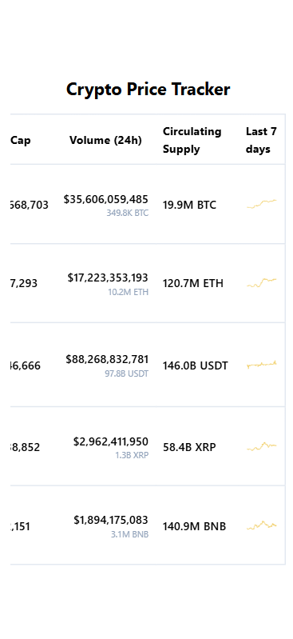
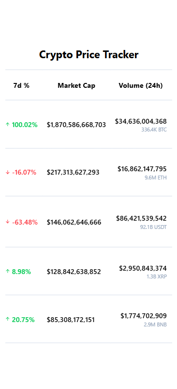
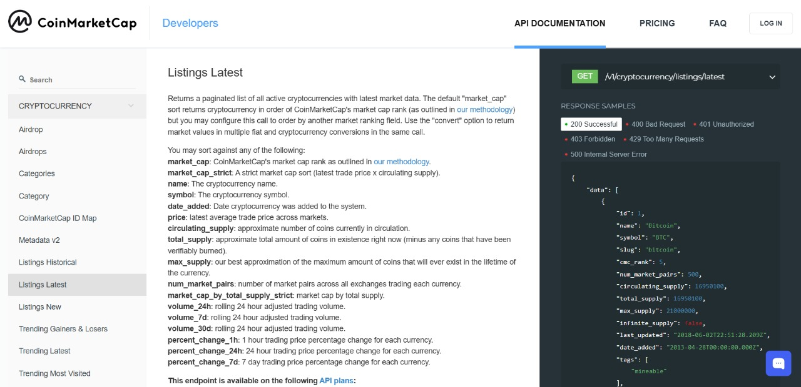
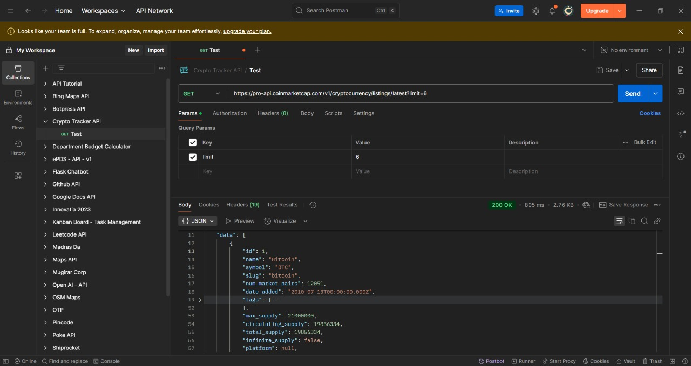
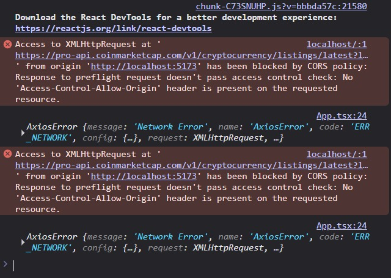

# Crypto Tracker

A **real-time crypto price tracker** built using **React + Redux Toolkit**, simulating WebSocket updates and managing all crypto state via Redux.

---

## Tech Stack

- **Frontend:** React, Redux Toolkit, TypeScript, TailwindCSS
- **Backend:** Node.js, Express
- **API:** CoinMarketCap (via backend server due to CORS restrictions)
- **State Management:** Redux Toolkit (`createSlice`, `configureStore`)
- **Icons:** lucide-react
- **Charts:** Static SVG charts

---

## Setup Instructions

### Prerequisites

Ensure you have the following installed

- **Node.js** (v14 or above)
- **npm** (v10 or above)
- **Git** (for version control)

### 1. Clone the Repository

Clone the repository to your system

```
git clone https://github.com/your-username/crypto-tracker.git
cd crypto-tracker
```

### 2. Setting up the Frontend

Move into the frontend directory and install the node packages

```
cd crypto-tracker-client
npm install
```

Create and add the following to the `.env` file

```
VITE_APP_API_URL=http://localhost:<your-port-number>/api
```

### 3. Setting up the Backend

A backend is used as a proxy because the API blocks requests from the client side due to CORS restrictions. Move into the backend directory and install the node packages

```
cd crypto-tracker-server
npm install
```

Create and add the following to the `.env` file

```
PORT=<your-port-number>
COIN_MARKET_CAP_API_KEY=<your-api-key>
COIN_MARKET_CAP_API_URL=https://pro-api.coinmarketcap.com/v1
```

### 4. Running the application

We need to run the application on two different terminals, on the first terminal run the client application

```
cd crypto-tracker-client
npm run dev
```

On the second terminal, run the server application

```
cd crypto-tracker-server
npm run start
```

### 5. View in browser

Now that the application has started running, visit the respective `locahost` port of your front-end application in the browser

---

# Results

## Desktop

[Desktop Output Video](output/desktop.mp4)

## Mobile




[Mobile Output Video](output/mobile.mp4)

---

# Thought Process

I first went and searched for Crypto Price tracker APIs and discovered Coin Market Cap


Then I tried out the API by creating an account, getting the API key and testing it out in Postman


I then sent a request from my react app, but I faced an error. It was a CORS error, it seems request is prohibited from client side and I had to create a backend proxy to send the API request


Then I created a backend proxy, tested it out and integrated it with my React App. Then I moved the local states to a Redux store using the `@reduxjs/toolkit` and `react-redux` packages. I also implemented the React app using TypeScript for avoiding unknown type related errors while fetching the data.

I also added a random modifier function which modifies the prices state randomly in an interval of `1 to 2 seconds` which resembled a WebSocket behaviour
